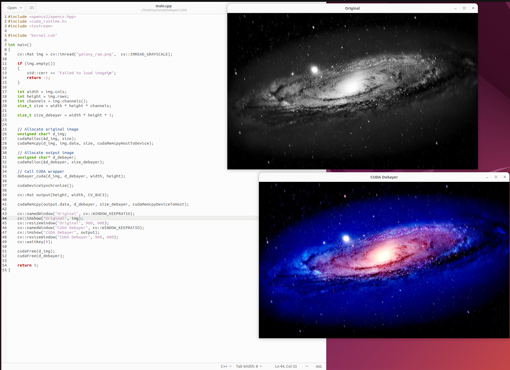

CUDA Debayer Kernel Demo
========================

This is a quick demo for debayering using CUDA. Assumes RGGB pattern but can be configured to a different pattern. 

How to build (must have CUDA toolkit installed):
```bash
nvcc main.cpp kernel.cu -o a.o `pkg-config --cflags --libs opencv4`
```

How to run:
```bash
./a.o
```

This repo also contains Python helper scripts to convert to and from raw image and RGB

CD to debayerConverter:
```bash
cd debayerConverter
```

Create a raw image simulation from galaxy.png (in RGGB):
```bash
python3 bayerify.py
```


Run the reconstruction as: (outputs to reconstructed.png)
```bash
python3 debayer.py
```

Demo of program running:



License: GNU GPL v2 as published by the Free Software Foundation
Big credit for most kernel code: Avionic Design GmbH, [https://github.com/avionic-design/cuda-debayer/blob/master/src/bayer2rgb.cu](https://github.com/avionic-design/cuda-debayer/blob/master/src/bayer2rgb.cu)

I had to simplify it but most logic remains the same.
